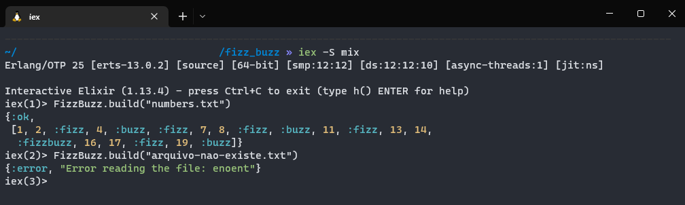
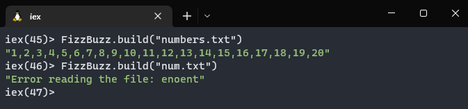
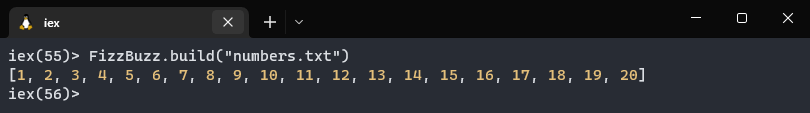
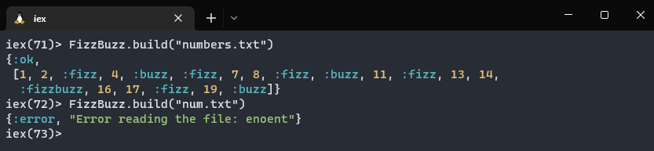

# FizzBuzz

Projeto realizado em curso do Rafael Camarda para praticar conceitos da linguagem de programação funcional Elixir.

> FizzBuzz é um jogo de palavras em grupo para crianças aprenderem sobre divisão.  
> Os jogadores se juntam em uma roda para contar os números, um de cada vez.  
> Os números múltiplos de 3  devem ser substituídos pela palavra "Fizz".  
> Os números múltiplos de 5 devem ser substituídos pela palavra "Buzz".  
> Quando um número for múltiplo de 3 e 5, deve ser substituído pela palavra "FizzBuzz".  

## Instalação
**Caso não queira instalar o Elixir na sua máquina, pule essa etapa.**

- Você pode fazer o clone desse repositório se quiser rodá-lo no seu terminal. 
  - Instale o [Elixir na sua máquina](https://elixir-lang.org/install.html)
  - Clone esse projeto com o `git clone` 
  - Inicie o terminal interativo do Elixir com o comando `iex -S mix`.
  - Rode: `FizzBuzz.build("numbers.txt")` para ver o resultado final.
  - Rode: `FizzBuzz.build("arquivo-nao-existe.txt")` para ver a mensagem de erro.
  - Para sair do terminal interativo do Elixir: `ctrl+c` & `abort`.

## Explicação do código e do projeto

- Primeiro passo foi criar o novo projeto Elixir com o comando `mix new fizz_buzz` e entrar na pasta.
- Criar um arquivo de números que tenham ou não múltiplos de 3 e 5.
  - Arquivo `numbers.txt` com números de 1 à 20.
- Fazer a leitura do arquivo, mostrando o resultado quando :ok e mensagem de erro quando :error.
 
- Converter o arquivo que está como string para lista de números.
 
- Substituir os números múltiplos de 3 por :fizz, múltiplos de 5 por :buzz, múltiplos de 3 e 5 por :fizzbuzz.

